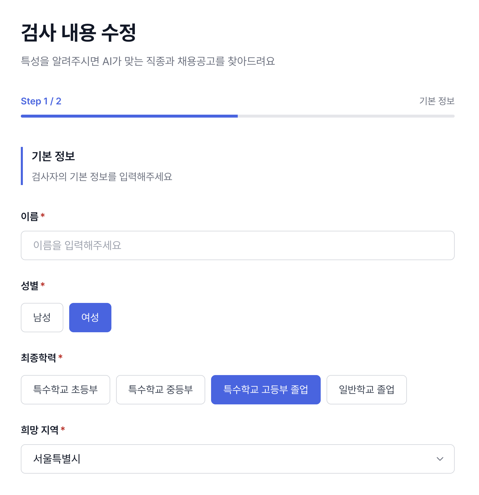
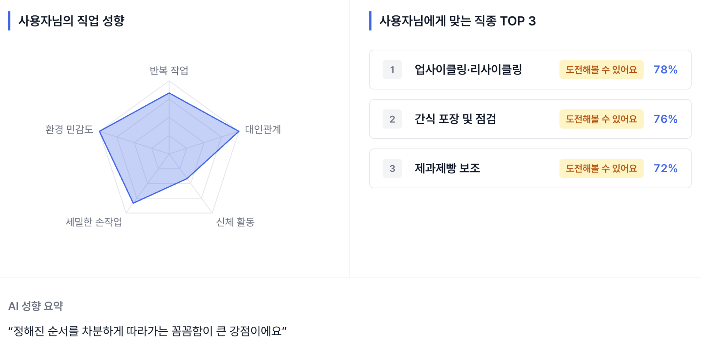
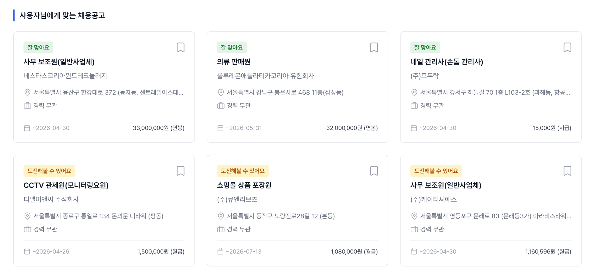

# 마주봄 — 장애인 맞춤 AI 직종 탐색 서비스

> 개인의 특성을 바탕으로 AI가 적합한 직종과 채용공고를 분석해드려요

**서비스 URL**: https://matchzoom.vercel.app


---

## 1) 제품 및 서비스의 목적 기능 및 특징

### 목적 및 배경

장애를 가진 사람과 보호자가 겪는 두 가지 핵심 문제를 해결합니다.

1. **본인이 어떤 직종이 맞는지 모른다** — 장애 유형·신체 조건·희망 활동 등 개인 특성을 종합 분석하여 적합 직종을 AI로 매칭합니다.
2. **채용공고를 봐도 적합한 환경인지 판단할 수 없다** — 장애인 대상 채용공고를 자동 수집하고, 사용자 프로필과 대조하여 적합도를 3단계(잘 맞아요 / 도전해볼 수 있어요 / 힘들 수 있어요)로 표시합니다.

기존 장애인 취업 서비스(워크넷 직업평가, 장애인고용공단 직업능력평가)는 장애인 **본인만** 대상으로 설계되어 있고, 전문기관 방문이 필수이며 수일~수주가 소요됩니다. **마주봄은 보호자도 주 타겟으로 설정**하여, 자녀의 취업을 돕는 부모가 3분 만에 온라인으로 검사를 완료하고 결과를 확인할 수 있습니다.

### 핵심 기능

#### 기능 1. 특성 검사 (약 3분 소요)

2단계 폼으로 사용자의 신체 조건, 인지·소통 역량, 희망 활동을 입력합니다.

- **Step 1 — 기본 정보**: 이름, 성별, 최종학력, 희망 지역
- **Step 2 — 신체 조건 + 희망 활동**: 장애 유형(복수 선택), 장애 정도, 이동 능력, 손 사용 능력, 체력, 의사소통 수준, 지시 이해 수준, 희망 활동(복수 선택)



#### 기능 2. AI 직종 매칭

프로필 데이터를 OpenAI GPT에 전달하여 **6단계 체계화된 분석**을 수행합니다.

- **5축 레이더 차트**: 반복 작업 적합도 / 대인관계 / 신체 활동 / 세밀한 손작업 / 환경 민감도
- **매칭 직종 TOP 3**: 한국장애인개발원 공식 45개 직무 + 한국장애인고용공단 표준사업장 직무 중 적합 직종 선정
- **AI 한 줄 요약**: 워크넷 NCS(국가직무능력표준) 키워드를 자연어로 변환한 맞춤 설명



#### 기능 3. 맞춤 채용공고 적합도 분석

한국장애인고용공단 채용공고 API에서 실시간 수집한 공고를 사용자 프로필과 대조하여 적합도 배지를 자동 부여합니다.

- **적합도 3단계 배지**: 잘 맞아요(녹색) / 도전해볼 수 있어요(노란색) / 힘들 수 있어요(빨간색)
- **필터링**: 적합도별, 지역별 필터
- **북마크**: 관심 공고 스크랩 기능



### 핵심 기술

| 영역 | 기술 |
|------|------|
| Framework | Next.js 16 App Router |
| Language | TypeScript (strict mode) |
| AI | OpenAI GPT API |
| 개발 도구 | Claude Code |
| DB | Supabase (PostgreSQL) |
| Styling | TailwindCSS v4 |
| 차트 | Recharts |
| 배포 | Vercel |
| 아키텍처 | FSD (Feature-Sliced Design) |

---

## 2) 제품 및 서비스의 고용노동 데이터 활용 방안 (활용성)

### 활용 중인 고용노동 데이터

| 연번 | 제공기관 | 데이터명 | 활용 목적 | 출처 |
|------|----------|----------|-----------|------|
| 1 | 한국장애인고용공단 | 장애인 채용공고 데이터 (XML API) | 장애인 대상 채용공고 실시간 수집, 적합도 분석 대상 데이터 | 공공데이터포털 |
| 2 | 한국고용정보원 (워크넷) | 표준직무기술서 NCS API (`callOpenApiSvcInfo215L01`) | 직종별 능력단위·지식기술태도 키워드 추출, AI 요약 텍스트 생성 시 근거 자료 | 기관 대표홈페이지 (work24.go.kr) |

### 데이터 활용 흐름

```
[한국장애인고용공단 API] ──XML──→ 파싱 → 채용공고 리스트
                                        ↓
                              사용자 프로필과 대조 → 적합도 배지 부여 → 대시보드 노출

[워크넷 NCS API] ──JSON──→ 직종별 능력단위 추출
                                   ↓
                        OpenAI GPT에 NCS 키워드 전달 → 자연어 요약 텍스트 생성
```

#### 채용공고 데이터 활용 상세

한국장애인고용공단 API로부터 장애인 대상 채용공고를 수집하며, 각 공고에 포함된 근무 환경 정보(양손 사용 여부, 시력 요구, 손작업 정밀도, 중량물 취급, 의사소통 필요도, 서서 걷기 등)를 사용자 프로필의 신체 조건과 자동 대조합니다.

#### NCS 데이터 활용 상세

워크넷 표준직무기술서 API에서 45개 화이트리스트 직종 각각의 NCS 능력단위(`job_sdvn`), 지식기술태도(`knwg_tchn_attd`), 능력 정의(`ablt_def`)를 추출합니다. 이 데이터는 AI가 사용자에게 표시할 한 줄 요약 텍스트를 생성할 때, NCS 키워드를 자연어로 변환하는 근거로 사용됩니다.

예시:
- NCS 키워드 "세탁물 분류 능력" → "빨래를 종류별로 가려내는"
- NCS 키워드 "포장기법" → "꼼꼼하게 포장하는"

### 공공데이터 확보의 지속성 및 가공 가능성

- **지속성**: 두 API 모두 정부 공공데이터 포털 및 기관 공식 Open API로 제공되어, 서비스 운영 기간 동안 안정적으로 확보 가능합니다.
- **활용범위**: 현재 채용공고 적합도 분석과 NCS 기반 요약 생성에 활용하고 있으며, 향후 직업훈련 정보 연계, 지역별 취업률 통계 분석 등으로 확장 가능합니다.
- **가공**: 채용공고 XML 데이터를 파싱하여 정형화된 카드 UI로 가공하고, NCS 데이터는 24시간 캐싱(`unstable_cache`, `revalidate: 86400`)으로 API 호출을 최소화하면서 최신 데이터를 유지합니다.

---

## 3) 제품 및 서비스의 AI 활용 방안 (활용성)

### 활용 AI 기술

| AI 기술 | 활용 영역 | 활용 방식 |
|---------|-----------|-----------|
| **OpenAI GPT API** (생성형 AI) | 직업 적합도 분석 | 프로필 데이터를 6단계 체계화된 프롬프트로 분석하여 레이더 차트·TOP3 직종 생성 |
| **OpenAI GPT API** (생성형 AI) | NCS 기반 요약 생성 | 워크넷 NCS 키워드를 자연어로 변환하여 사용자 맞춤 한 줄 요약 텍스트 생성 |
| **Claude Code** (AI 코딩 도구) | 소프트웨어 개발 전반 | 코드 작성, 아키텍처 설계, 코드 리뷰, 테스트 작성, PR 생성 등 개발 워크플로우 전체 |

### AI 직업 적합도 분석 — 6단계 프로세스

마주봄의 핵심 AI 기능은 단순한 키워드 매칭이 아닌, **6단계 체계화된 프롬프트 엔지니어링**으로 설계되었습니다.

```
STEP 1. 출력 형식 정의 (JSON 스키마)
    ↓
STEP 2. 하드 제약 판정 (안전 최우선 — 신체·인지 제약 초과 직무 즉시 배제)
    ↓
STEP 3. 레이더 차트 점수 계산 (기본값 + 가산/상한 규칙, 장애 유형별 차별화)
    ↓
STEP 4. 직종 화이트리스트 검증 (45개 공식 직무에서만 선택, 창작 금지)
    ↓
STEP 5. TOP3 직무 선정 + match_pct 계산 (4요소 가산 공식)
    ↓
STEP 6. 자가 검증 체크리스트 (7개 카테고리, 20+ 항목 통과 후 출력)
```

#### 안전 설계 원칙

- **하드 제약 판정**: 휠체어 사용자에게 이동이 많은 직무를 추천하지 않고, 손 사용이 어려운 사용자에게 정밀 작업 직무를 추천하지 않는 등 **안전이 최우선**입니다.
- **화이트리스트 강제**: AI가 임의로 직종명을 만들지 못하도록, 한국장애인개발원 공식 45개 직무 + 한국장애인고용공단 표준사업장 직무 목록에서만 선택하게 합니다.
- **자가 검증**: AI 출력 전 하드 제약 준수, 레이더 상한/하한, 장애 유형별 차별화, 화이트리스트 일치, 다양성, match_pct 규칙, 형식까지 7개 카테고리 체크리스트를 통과해야 합니다.

#### NCS 기반 요약 생성 (2차 AI 호출)

1차 분석에서 선정된 TOP3 직종의 NCS 능력단위·지식기술태도 키워드를 2차 OpenAI 호출에 전달하여, 공공데이터에 근거한 맞춤 한 줄 요약을 생성합니다.

예시 출력: *"정해진 순서를 차분하게 따라가는 꼼꼼함이 큰 강점이에요"*

### AI 기술의 지속성 및 활용범위

- **지속성**: OpenAI GPT API는 상용 서비스로 안정적이며, 프롬프트 기반이므로 모델 업그레이드 시에도 프롬프트 조정만으로 대응 가능합니다.
- **확장 가능성**: 현재 직종 매칭에 활용하고 있으며, 향후 직업훈련 과정 추천, 면접 준비 도우미, 근무 적응 모니터링 등으로 AI 활용 범위를 확대할 수 있습니다.

---

## 4) 제품 및 서비스를 활용한 창업(사업) 계획 (실용성)

### 팀의 추진 의지

마주봄 팀은 장애인 고용 복지 분야의 사회적 가치와 기술 혁신을 결합하여, **장애인·보호자가 직접 사용할 수 있는 AI 취업 도구**를 만들겠다는 목표로 서비스를 개발하였습니다. 현재 실제 서비스가 Vercel에 배포되어 운영 중이며, 지속적으로 기능을 개선하고 있습니다.

### 사업화 계획

#### 단기 (6개월)

- MVP 서비스 안정화 및 사용자 피드백 수집
- 장애인 복지관·특수학교 파일럿 운영 (5개소)
- 사용자 1,000명 확보

#### 중기 (1년)

- **B2G 사업 모델**: 지자체·한국장애인고용공단과 협력하여 장애인 취업 지원 플랫폼으로 납품
- **B2B 사업 모델**: 장애인 고용 의무기업 대상 SaaS 구독 서비스 (직원 적합 직무 배치 도구)
- 직업훈련기관 연계 기능 추가

#### 장기 (2년 이상)

- 전국 장애인 복지관 네트워크 확산
- 고용 이후 적응 모니터링 기능 출시
- 해외 시장 진출 (동남아 장애인 고용 시장)

---

## 5) 제품 및 서비스의 차별성 (차별성)

### 기존 서비스와 비교

| 비교 항목 | 워크넷 장애인 고용 | 한국장애인고용공단 직업능력평가 | **마주봄** |
|-----------|-------------------|-------------------------------|------------|
| **대상** | 장애인 본인 | 장애인 본인 | **장애인 본인 + 보호자** |
| **소요 시간** | 공고 검색 수동 | 전문기관 방문, 수일~수주 | **3분 온라인 검사** |
| **분석 방식** | 키워드 검색 | 전문가 수동 평가 | **AI 자동 분석 (6단계 프롬프트)** |
| **채용공고 연동** | 일반 공고 검색 | 없음 | **적합도 배지 자동 부여** |
| **직종 추천** | 없음 | 보고서 형태 | **레이더 차트 + TOP3 직종 + 매칭률** |
| **비용** | 무료 | 무료 (대기 필요) | **무료** |
| **접근성** | 웹사이트 | 오프라인 방문 필수 | **모바일/PC 웹 즉시 이용** |
| **데이터 근거** | 채용공고만 | 전문가 경험 | **공공데이터(NCS) + AI 분석** |
| **안전 설계** | 해당 없음 | 전문가 판단 | **하드 제약 자동 판정 (신체 제약 초과 직무 배제)** |

### 핵심 차별점

1. **보호자 중심 UX**: "우리 아이에게 맞는 일"이라는 관점에서 설계하여, 보호자가 자녀의 특성을 입력하고 결과를 함께 확인할 수 있습니다.
2. **공공데이터 + AI 결합**: 워크넷 NCS 데이터와 장애인고용공단 채용공고를 AI가 종합 분석하여, 단순 검색이 아닌 **맞춤 분석**을 제공합니다.
3. **안전 최우선 설계**: AI가 추천할 수 있는 직종을 공식 화이트리스트로 제한하고, 신체·인지 제약을 초과하는 직무를 자동 배제합니다.
4. **즉시 확인 가능한 결과**: 기관 방문·대기 없이 3분 검사 후 바로 레이더 차트, TOP3 직종, 맞춤 채용공고를 확인할 수 있습니다.

---

## 6) 제품 및 서비스의 사업화 계획 (효과성)

### 홍보 및 마케팅 전략

| 채널 | 전략 | 기대 효과 |
|------|------|-----------|
| **장애인 복지관 네트워크** | 전국 복지관 직업재활팀 대상 시연·교육 | 실 수요자 직접 도달 |
| **특수학교 연계** | 전공과·진로 수업에서 활용 도구로 도입 | 졸업 전 직종 탐색 제공 |
| **SNS/커뮤니티** | 장애인 보호자 카페·커뮤니티 후기 공유 | 바이럴 확산 |
| **공공기관 협력** | 고용노동부·장애인고용공단 공식 연계 | 서비스 신뢰도 확보 |

### 수익 모델

| 모델 | 대상 | 내용 |
|------|------|------|
| **프리미엄 분석 보고서** | 보호자·본인 | 상세 직무 분석 보고서 PDF 다운로드 (월 구독 또는 건별 과금) |
| **B2G 계약** | 지자체·공공기관 | 장애인 취업 지원 플랫폼으로 납품·운영 위탁 |
| **B2B SaaS** | 장애인 고용 의무기업 | 직원 적합 직무 배치·관리 도구 구독 서비스 |
| **직업훈련 연계 수수료** | 훈련기관 | 매칭된 직종의 훈련과정 연계 시 수수료 |

### 사업화 실현 가능성

1. **기술 완성도**: Next.js 16 + Vercel 배포로 즉시 서비스 가능한 상태이며, 실제 URL(https://matchzoom.vercel.app)에서 운영 중입니다.
2. **데이터 확보**: 공공데이터포털 및 워크넷 Open API를 활용하므로, 별도 데이터 구매 없이 지속적으로 최신 데이터를 확보할 수 있습니다.
3. **확장성**: FSD 아키텍처 기반으로 기능 모듈이 독립적이어서, 새로운 기능(직업훈련 연계, 적응 모니터링 등)을 빠르게 추가할 수 있습니다.
4. **시장 수요**: 2024년 기준 등록 장애인 약 265만 명, 장애인 고용 의무기업 약 3만 개로, 잠재 시장이 충분합니다.
