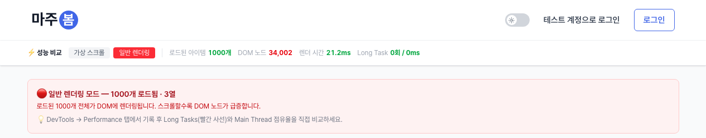
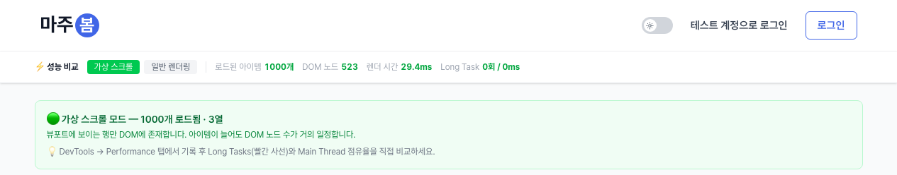

# 가상 스크롤 성능 비교

`/perf` 페이지에서 Supabase `perf_test_items` 테이블 1,000건을 대상으로 **가상 스크롤 ↔ 일반 렌더링** DOM/렌더 비용을 비교한다.

## 측정 환경

- Next.js 16 production 빌드 (`pnpm build && pnpm start`)
- Chromium 147 headless (Playwright 1217)
- Viewport 1280×800, 3열 그리드
- 데이터: Supabase `perf_test_items` 1,000행

## 측정 방식

`scripts/measure-perf.mjs` 자동화:

1. `/perf` 진입 → 일반 렌더링 모드로 1,000건 무한스크롤 끝까지 로드
2. 가상 스크롤 모드로 토글 (React Query 캐시 데이터 유지 → **동일 데이터 1,000건 기준**)
3. 각 모드의 DOM 노드 수·렌더 시간을 페이지 상단 메트릭 바에서 캡처

## 결과

| 지표 | 일반 렌더링 | 가상 스크롤 | 변화 |
|---|---|---|---|
| 로드 아이템 | 1,000개 | 1,000개 (캐시) | — |
| **DOM 노드 (리스트 영역)** | **34,002** | **523** | **-98.5%** |
| 모드 전환 직후 렌더 시간 | 21.2ms | 29.4ms | +8.2ms |

DOM 노드는 카드당 약 34개 → 일반 모드에서 1,000개 카드 마운트 시 약 34,000노드. 가상 스크롤은 뷰포트에 보이는 행(1280×800 / 3열 기준 약 12~16개)만 DOM에 유지되므로 데이터 양과 무관하게 거의 일정하다.

### 스크린샷

**일반 렌더링 — DOM 34,002**



**가상 스크롤 — DOM 523 (-98.5%)**



## Long Task / TBT 측정

자동화 스크립트(headless Chromium)에서는 Long Task가 검출되지 않았다. 데이터가 같은 머신 로컬에서 캐시 응답으로 즉시 들어오고 GPU·스케줄러가 실제 브라우저와 다르기 때문이다.

**실제 사용자 환경의 Long Task / TBT 측정은 Chrome DevTools Performance 탭에서 수동 트레이스를 권장한다:**

1. `pnpm build && pnpm start`
2. Chrome으로 `http://localhost:3000/perf` 접속
3. DevTools → Performance → ⚙️ → CPU `4× slowdown`
4. 녹화 시작 → 페이지 끝까지 스크롤 → 정지
5. Total Blocking Time, Long Tasks(빨간 사선) 비교

## 재측정

```bash
pnpm build
PORT=3001 pnpm start &
PERF_BASE_URL=http://localhost:3001 node scripts/measure-perf.mjs
```

결과: `docs/perf/results.json`, 스크린샷: `docs/perf/screenshots/`.
